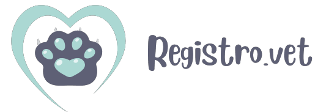
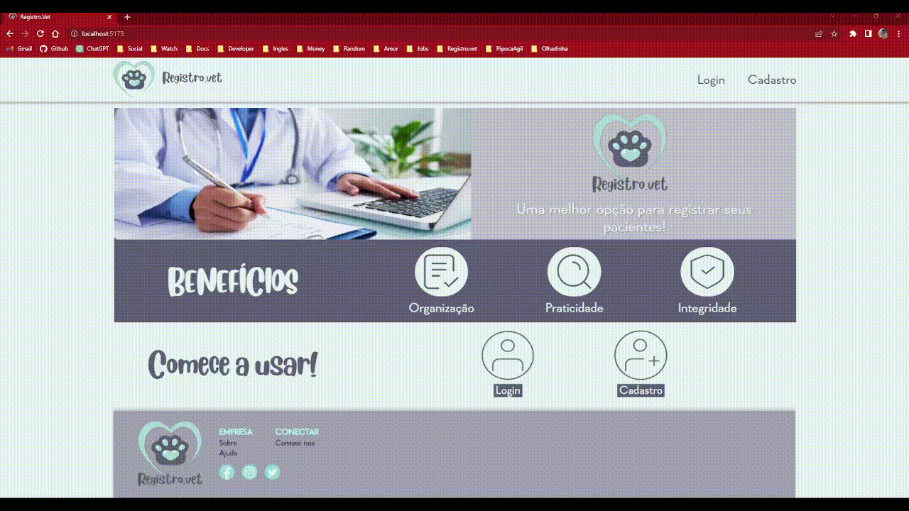

<h1><strong>Registro.Vet</strong></h1>

<!-- 

 -->

## **About the Project**
  
Register and manage the pet patients of a veterinary clinic.  
The purpose of this project is to create a robust website, from the backend and database to the frontend, and deploy it.  
The creator of the project is [Giuliana Karla](https://www.behance.net/giuxdesigner), she is a UX  and Graphic Designer. I saw her portfolio and realized it would be a great idea to bring the website to life. It is not yet finalized, so over time, new features and screens will be added.  

## **Preview**  

### **Technologies used on this project:**  

| Tech                   | Version |
|------------------------|---------|
| Java                   | 20      |
| Spring                 | 3.0.6   |
| Maven                  | 4.0     |
| TypeScript             | 5.0.2   |
| React                  | 18.2    |
| MySQL                  | 8.0.33  |

**Other Technologies:**
- __Frontend:__ React Hook Form, React Router, Axios, Vite.
- __Backend:__ MVC pattern, Spring Boot, Spring Security, JWT, Spring Data JPA, API REST.

